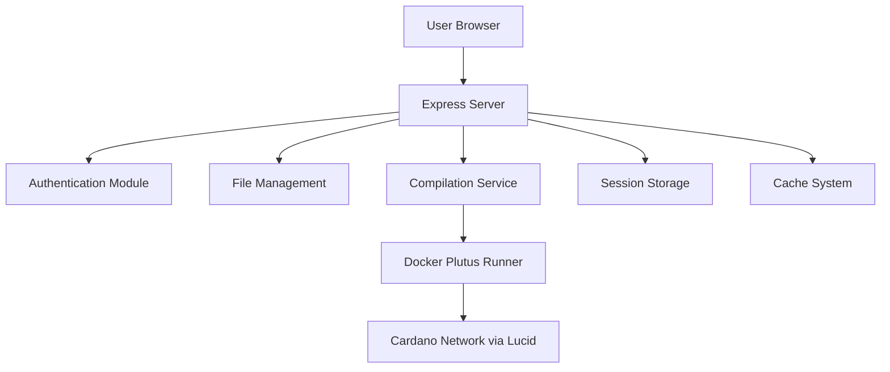
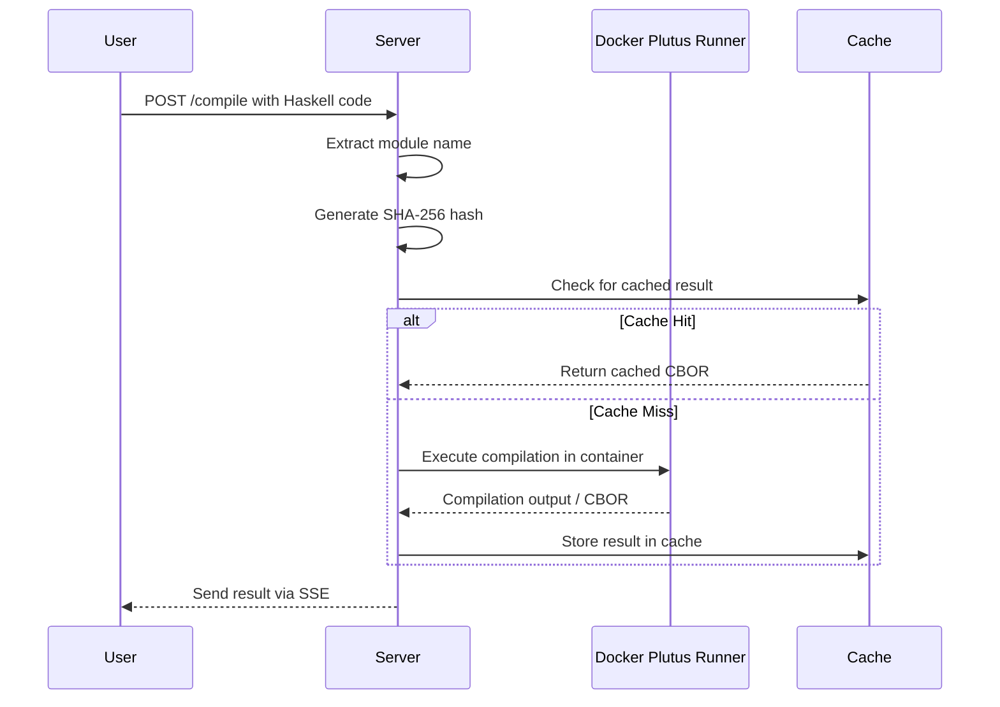

# Plutus Playground Backend Documentation

## Overview

This is the backend component of the Plutus Playground, a web-based IDE for developing and testing Plutus smart contracts on the Cardano blockchain. The backend provides authentication, session management, file system operations, compilation caching, and integration with Docker for running Plutus code.

## Architecture Diagram

## Project Structure

### Root Files

- **server.js**: Main Express server file handling HTTP requests, sessions, and routing.
- **auth.js**: Authentication module for user registration, login, and session management.
- **cache.js**: Caching system for Plutus compilation results using SHA-256 hashes.
- **utils.js**: Utility functions for extracting module names from Haskell code and Server-Sent Events (SSE) handling.
- **getAddress.js**: Wallet connection utilities for interacting with Cardano wallets (Nami, Lace, Eternl).
- **package.json**: Node.js project configuration with dependencies.
- **users.json**: JSON file storing user credentials (hashed passwords).
- **cache.json**: JSON file storing cached compilation results.
- **index.html**: Main IDE interface with Monaco editor.
- **login.html**: Login and registration page.

### Directories

- **assets/**: Static assets (CSS, JS, images) for the web interface.
- **sessions/**: Persistent session storage files.
- **tmp/**: Temporary files and directories.
- **workspaces/**: User-specific workspaces containing Haskell source files and compilation artifacts.

## Key Features

### Authentication
- User registration and login with bcrypt password hashing.
- Session-based authentication using express-session with file store.
- Protected routes requiring authentication.

### File Management
- User-specific workspaces isolated via Docker containers.
- File listing, creation, editing, and deletion operations.
- Support for directory navigation.

### Compilation and Execution
- Plutus code compilation using Docker (plutus-runner container).
- Caching of compilation results to improve performance.
- Real-time output via Server-Sent Events (SSE).

### Wallet Integration
- Connection to Cardano wallets (Nami, Lace, Eternl).
- Support for deploying and interacting with smart contracts.

## Compilation Flow Diagram

## Dependencies

- **express**: Web framework for Node.js.
- **bcrypt**: Password hashing.
- **jsonwebtoken**: JWT token handling.
- **lucid-cardano**: Cardano blockchain interaction library.
- **cors**: Cross-origin resource sharing.
- **express-session**: Session management.
- **session-file-store**: File-based session storage.
- **uuid**: Unique identifier generation.

## API Endpoints

### Public Routes
- `GET /`: Redirects to login or IDE based on session.
- `GET /login`: Login page.
- `GET /register`: Registration page.
- `POST /auth/register`: User registration.
- `POST /auth/login`: User login.

### Protected Routes (require authentication)
- `GET /ide`: Main IDE interface.
- `GET /workspace/files`: List files in user workspace.
- `POST /workspace/files`: Create/update files.
- `DELETE /workspace/files`: Delete files.
- `POST /compile`: Compile Plutus code.
- `POST /run`: Execute compiled code.

## Configuration

- Server runs on port 3000.
- Session secret should be set via `SESSION_SECRET` environment variable.
- Docker container `plutus-runner` is required for compilation.
- Blockfrost API key configured for Preprod network.

## Security Considerations

- Passwords are hashed with bcrypt.
- Sessions are HTTP-only and secure in production.
- User workspaces are isolated in Docker containers.
- CORS is disabled for SSR (Server-Side Rendering).