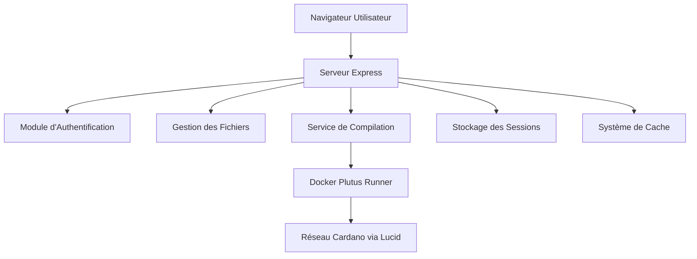
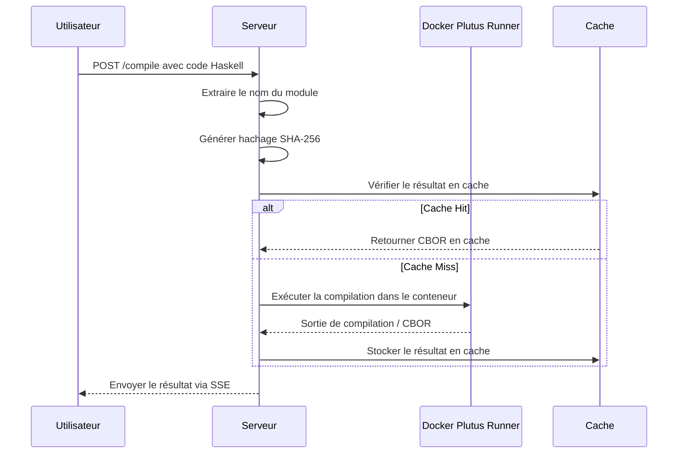

# Documentation du Backend Plutus Playground

## Vue d'ensemble

Il s'agit du composant backend du Plutus Playground, un IDE web pour développer et tester des contrats intelligents Plutus sur la blockchain Cardano. Le backend fournit l'authentification, la gestion des sessions, les opérations sur le système de fichiers, la mise en cache de la compilation et l'intégration avec Docker pour exécuter le code Plutus.

## Schéma d'Architecture

## Structure du Projet

### Fichiers Racine

- **server.js** : Fichier serveur Express principal gérant les requêtes HTTP, les sessions et le routage.
- **auth.js** : Module d'authentification pour l'inscription, la connexion des utilisateurs et la gestion des sessions.
- **cache.js** : Système de mise en cache des résultats de compilation Plutus utilisant des hachages SHA-256.
- **utils.js** : Fonctions utilitaires pour extraire les noms de modules du code Haskell et la gestion des Server-Sent Events (SSE).
- **getAddress.js** : Utilitaires de connexion au portefeuille pour interagir avec les portefeuilles Cardano (Nami, Lace, Eternl).
- **package.json** : Configuration du projet Node.js avec les dépendances.
- **users.json** : Fichier JSON stockant les informations d'identification des utilisateurs (mots de passe hachés).
- **cache.json** : Fichier JSON stockant les résultats de compilation mis en cache.
- **index.html** : Interface IDE principale avec l'éditeur Monaco.
- **login.html** : Page de connexion et d'inscription.

### Répertoires

- **assets/** : Ressources statiques (CSS, JS, images) pour l'interface web.
- **sessions/** : Fichiers de stockage persistant des sessions.
- **tmp/** : Fichiers et répertoires temporaires.
- **workspaces/** : Espaces de travail spécifiques aux utilisateurs contenant les fichiers source Haskell et les artefacts de compilation.

## Fonctionnalités Clés

### Authentification
- Inscription et connexion des utilisateurs avec hachage des mots de passe bcrypt.
- Authentification basée sur les sessions utilisant express-session avec stockage de fichiers.
- Routes protégées nécessitant une authentification.

### Gestion des Fichiers
- Espaces de travail spécifiques aux utilisateurs isolés via des conteneurs Docker.
- Opérations de listage, création, édition et suppression de fichiers.
- Support pour la navigation dans les répertoires.

### Compilation et Exécution
- Compilation du code Plutus utilisant Docker (conteneur plutus-runner).
- Mise en cache des résultats de compilation pour améliorer les performances.
- Sortie en temps réel via Server-Sent Events (SSE).

### Intégration du Portefeuille
- Connexion aux portefeuilles Cardano (Nami, Lace, Eternl).
- Support pour le déploiement et l'interaction avec les contrats intelligents.

## Schéma du Flux de Compilation

## Dépendances

- **express** : Framework web pour Node.js.
- **bcrypt** : Hachage des mots de passe.
- **jsonwebtoken** : Gestion des jetons JWT.
- **lucid-cardano** : Bibliothèque d'interaction avec la blockchain Cardano.
- **cors** : Partage des ressources cross-origin.
- **express-session** : Gestion des sessions.
- **session-file-store** : Stockage des sessions basé sur les fichiers.
- **uuid** : Génération d'identifiants uniques.

## Points de Terminaison API

### Routes Publiques
- `GET /` : Redirige vers la connexion ou l'IDE en fonction de la session.
- `GET /login` : Page de connexion.
- `GET /register` : Page d'inscription.
- `POST /auth/register` : Inscription des utilisateurs.
- `POST /auth/login` : Connexion des utilisateurs.

### Routes Protégées (nécessitent une authentification)
- `GET /ide` : Interface IDE principale.
- `GET /workspace/files` : Lister les fichiers dans l'espace de travail de l'utilisateur.
- `POST /workspace/files` : Créer/mettre à jour des fichiers.
- `DELETE /workspace/files` : Supprimer des fichiers.
- `POST /compile` : Compiler le code Plutus.
- `POST /run` : Exécuter le code compilé.

## Configuration

- Le serveur fonctionne sur le port 3000.
- Le secret de session doit être défini via la variable d'environnement `SESSION_SECRET`.
- Le conteneur Docker `plutus-runner` est requis pour la compilation.
- Clé API Blockfrost configurée pour le réseau Preprod.

## Considérations de Sécurité

- Les mots de passe sont hachés avec bcrypt.
- Les sessions sont HTTP-only et sécurisées en production.
- Les espaces de travail des utilisateurs sont isolés dans des conteneurs Docker.
- CORS est désactivé pour SSR (Server-Side Rendering).